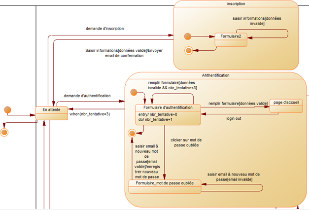
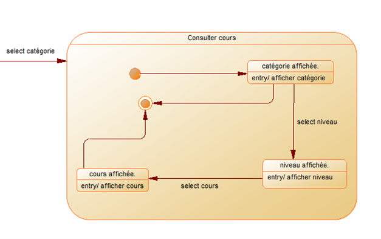
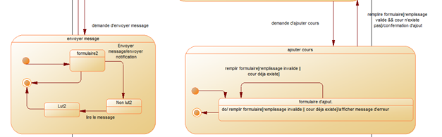
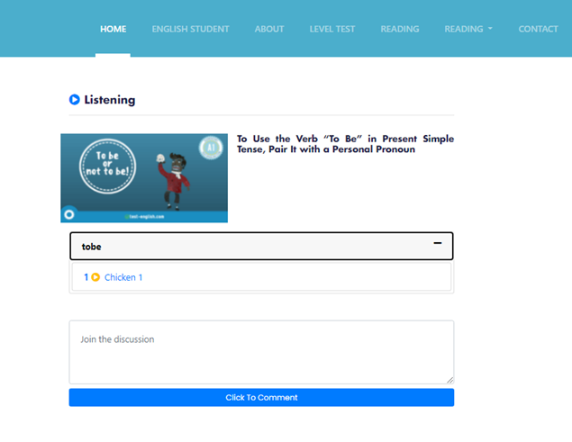
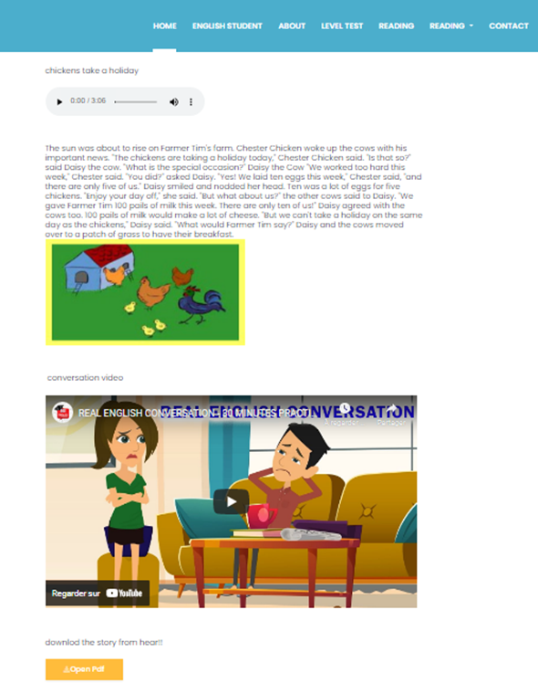
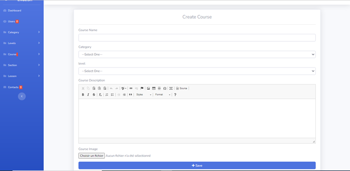
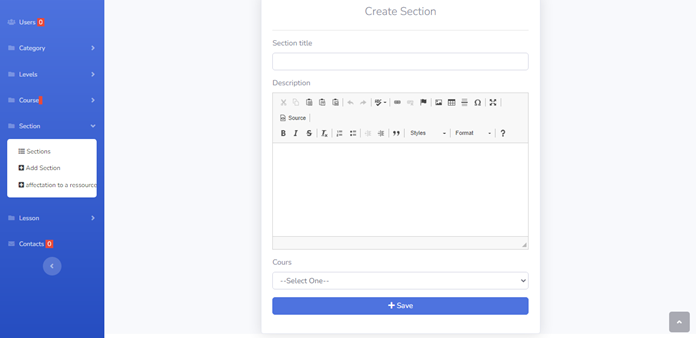
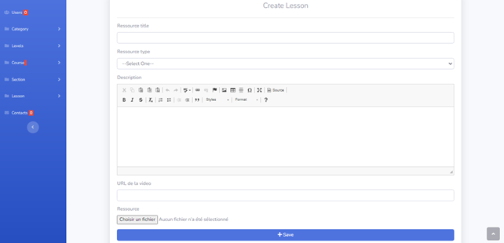
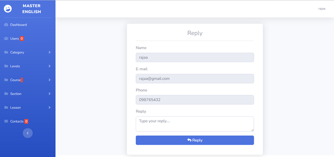

# 📚 **Projet E-Learning - Documentation**

## 📝 **Introduction**
Ce projet est une plateforme d'apprentissage en ligne permettant aux utilisateurs d'accéder à divers cours classés par catégories et niveaux. L'administration peut gérer les cours, les utilisateurs, les ressources pédagogiques, les exercices et les messages.

---

# ⚙️ **1. Conception de l'application**  

## 📌 **1.1. Fonctionnalités principales**  
Le site web comprend **dix modules** accessibles via un menu :  
✅ Module de gestion des catégories  
✅ Module de gestion des cours  
✅ Module de gestion des niveaux  
✅ Module de gestion des séquences  
✅ Module de gestion des ressources de cours  
✅ Module de gestion des exercices  
✅ Module de gestion des utilisateurs  
✅ Module de gestion des commentaires  
✅ Tableau de bord  
✅ Module de gestion des messages  

## 🗂 **1.2. Diagrammes UML**  

### 📊 **Diagramme de classe**

  

Ce diagramme présente la structure des classes et leurs relations.

### 📌 **Diagrammes de séquence**  
#### 🔹 Inscription  

  

Ce diagramme montre le processus d'inscription d'un utilisateur.

#### 🔹 Authentification  

  

Ce diagramme illustre l'authentification d'un utilisateur.

#### 🔹 Consulter un cours  

  

Diagramme de séquence pour la consultation d'un cours.

#### 🔹 Ajouter un cours  

  

Processus d'ajout d'un cours par un administrateur.

#### 🔹 Contact  

  

Diagramme de séquence pour l'envoi de messages via le formulaire de contact.

### 🔄 **Diagrammes d’état-transition**  

  
  
  

Diagrammes d'état transition montrant les différents états du système.

---

# 🖥 **2. Interfaces de l'application**  

## 🎓 **2.1. Interfaces de l’espace Apprenant**  

### 🏠 **Page d’accueil**

  

Page d’accueil affichée après l'authentification de l'apprenant.

### 📂 **Consulter les catégories, niveaux et cours**  
#### 🔹 Catégories  

  

Liste des différentes catégories de cours disponibles.

#### 🔹 Niveaux  

  

Affichage des niveaux d'apprentissage disponibles.

#### 🔹 Cours  

  
  
  

Différentes vues de la liste des cours accessibles aux apprenants.

---

## 🛠 **2.2. Interfaces de l’espace Administrateur**  

### 👤 **Gestion des utilisateurs**  
#### 🔹 Liste des utilisateurs  

  

Affichage des utilisateurs enregistrés avec leurs rôles.

### 📂 **Gestion des catégories, niveaux, cours et séquences**  
#### 🔹 Catégories  

  

Interface de gestion des catégories de cours.

#### 🔹 Niveaux  

  

Interface pour gérer les niveaux d’apprentissage.

#### 🔹 Cours  

  
  

Interface pour la gestion des cours disponibles.

#### 🔹 Séquences  

  
  

Interface permettant la gestion des séquences d'un cours.

### 📚 **Gestion des ressources et des messages**  
#### 🔹 Ressources  

  
  

Gestion des documents, vidéos et autres ressources pédagogiques.

#### 🔹 Messages  

  
  

Interface de gestion des messages envoyés par les utilisateurs.

---

## ✅ **Conclusion**
Ce projet E-Learning offre une solution complète pour l'enseignement en ligne avec une gestion simplifiée des cours, des utilisateurs et des ressources pédagogiques. Il garantit une expérience fluide et interactive pour les apprenants et les administrateurs. 🚀
