# 📚 **Projet E-Learning - Documentation**

## 📝 **Introduction**
Ce projet est une plateforme d'apprentissage en ligne permettant aux utilisateurs d'accéder à divers cours classés par catégories et niveaux. L'administration peut gérer les cours, les utilisateurs, les ressources pédagogiques, les exercices et les messages.

---

# ⚙️ **1. Conception de l'application**  

## 📌 **1.1. Fonctionnalités principales**  
Le site web comprend **dix modules** accessibles via un menu :  
✅ Module de gestion des catégories  
✅ Module de gestion des cours  
✅ Module de gestion des niveaux  
✅ Module de gestion des séquences  
✅ Module de gestion des ressources de cours  
✅ Module de gestion des exercices  
✅ Module de gestion des utilisateurs  
✅ Module de gestion des commentaires  
✅ Tableau de bord  
✅ Module de gestion des messages  

## 🗂 **1.2. Diagrammes UML**  

### 📊 **Diagramme de classe**
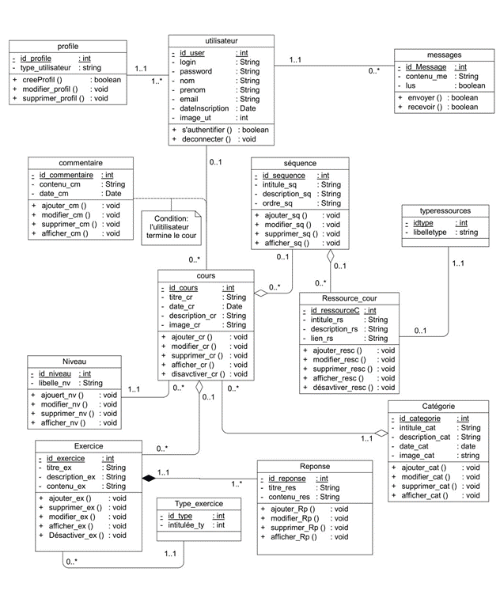

### 📌 **Diagrammes de séquence**  
- **Inscription**  
  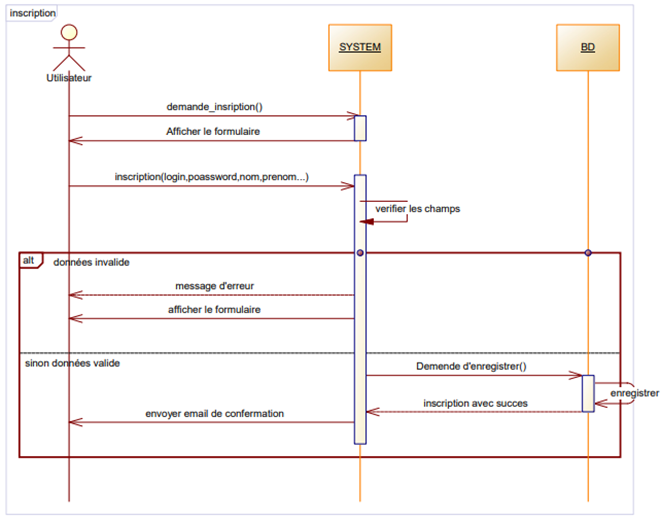  
- **Authentification**  
  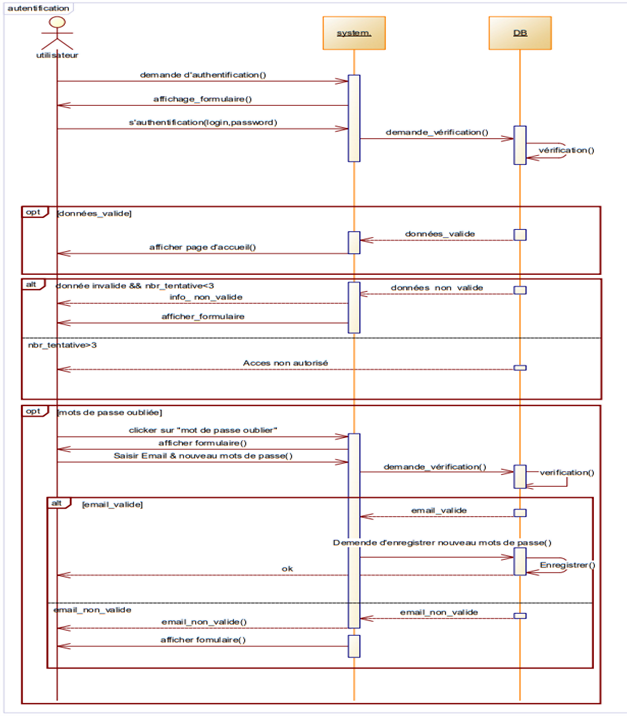  
- **Consulter un cours**  
  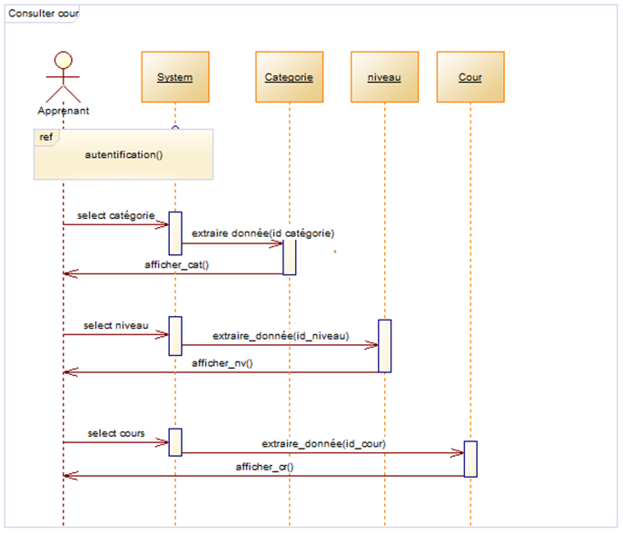  
- **Ajouter un cours**  
  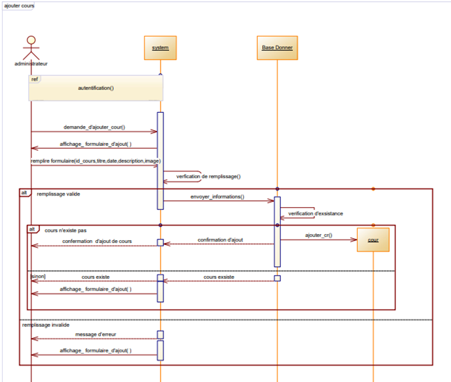  
- **Contact**  
  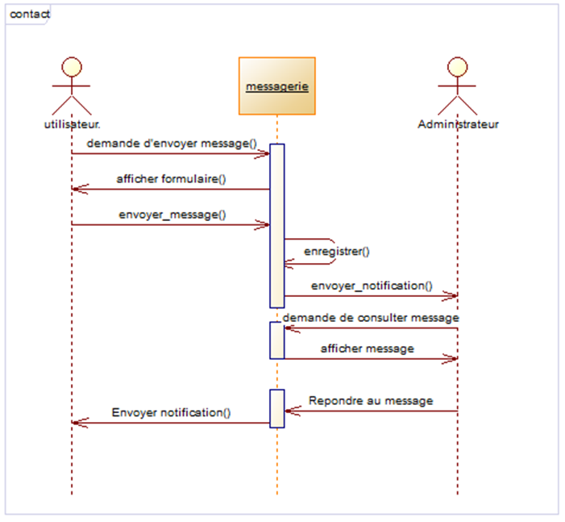  

### 🔄 **Diagramme d’état-transition**  
  

### 🎯 **Diagrammes d’Activité**  
- **Inscription**  
  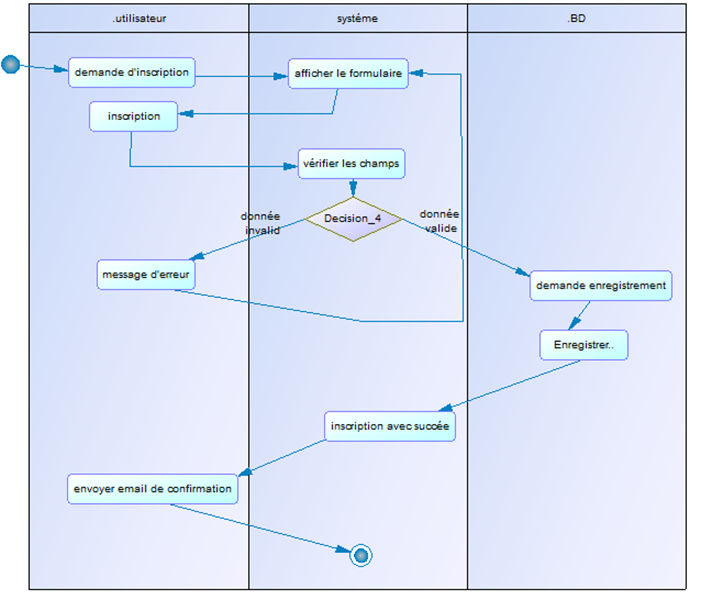  
- **Authentification**  
  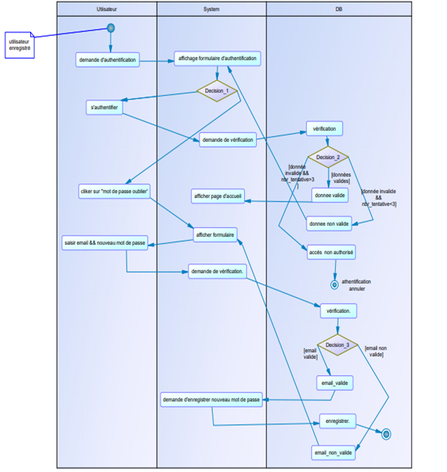  
- **Consulter un cours**  
  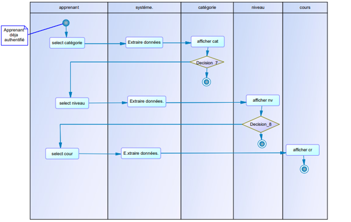  
- **Ajouter un cours**  
  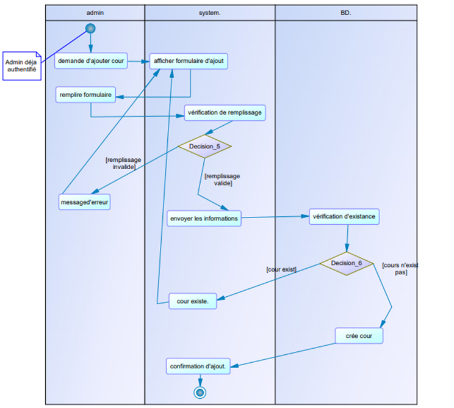  
- **Contact**  
  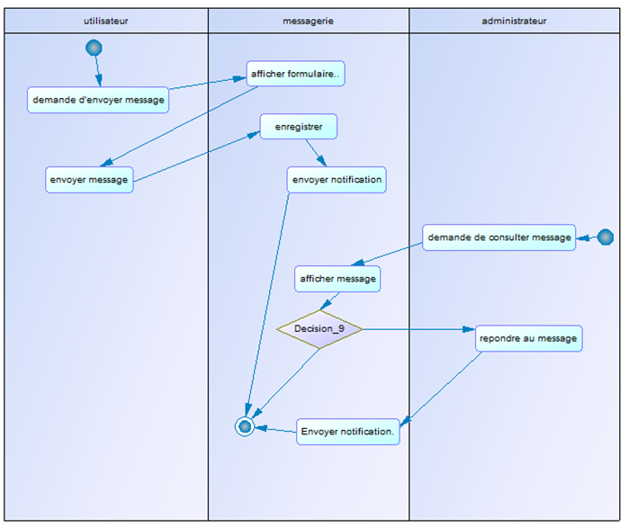  

---

# 🖥 **2. Interfaces de l'application**  

## 🎓 **2.1. Interfaces de l’espace Apprenant**  

### 🏠 **Page d’accueil**
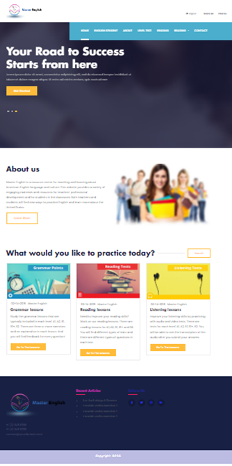  

### 📂 **Consulter les catégories, niveaux et cours**  
- **Catégories**  
  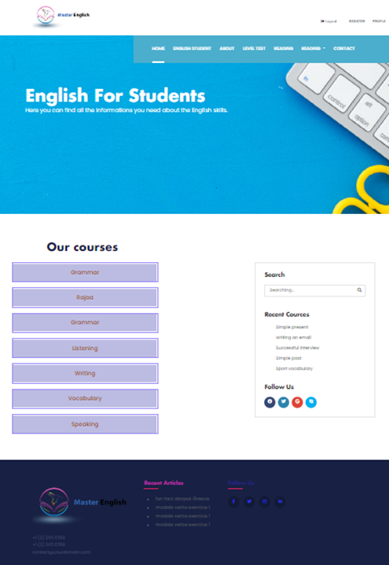  
- **Niveaux**  
  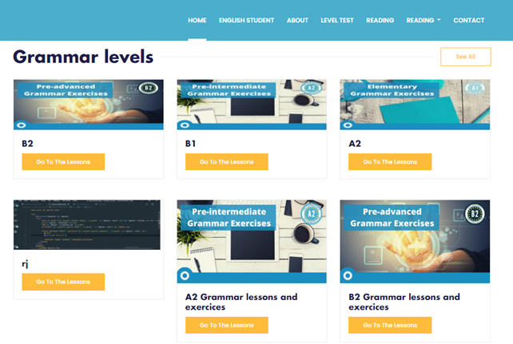  
- **Cours**  
  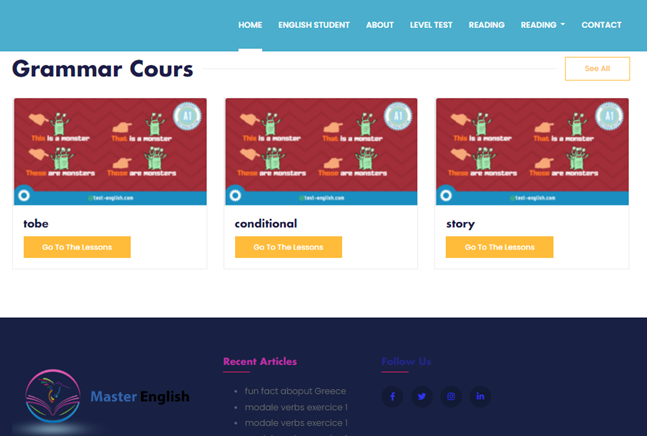  

### 📖 **Profil de l’apprenant**  
  

### ✉️ **Contact**  
  

### 🔐 **Mot de passe oublié et inscription**  
- **Mot de passe oublié**  
    
- **Inscription**  
    

---

## 🛠 **2.2. Interfaces de l’espace Administrateur**  

### 🏠 **Interface principale**  
  

### 👤 **Gestion des utilisateurs**  
- **Liste des utilisateurs**  
  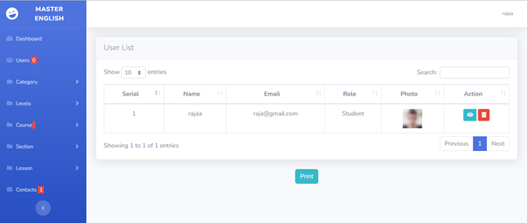  
- **Détails des utilisateurs**  
    

### 📂 **Gestion des catégories, niveaux, cours et séquences**  
- **Catégories**  
  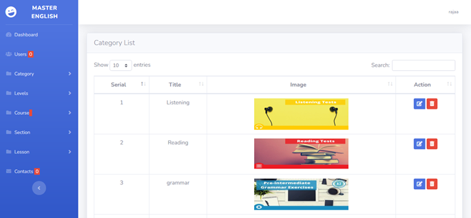  
- **Niveaux**  
  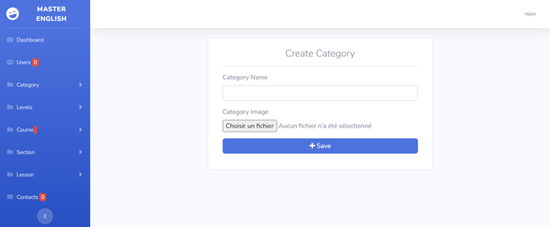  
- **Cours**  
  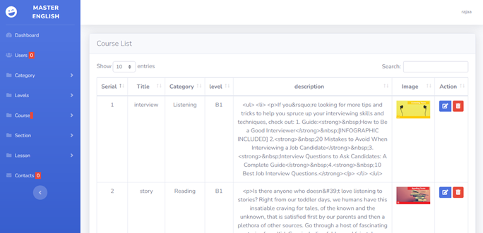  
- **Séquences**  
  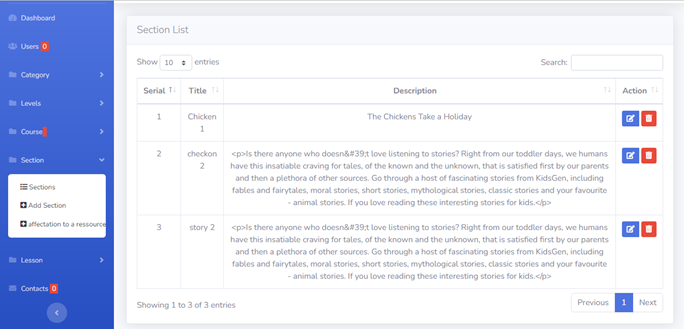  

### 📚 **Gestion des ressources et des messages**  
- **Ressources**  
  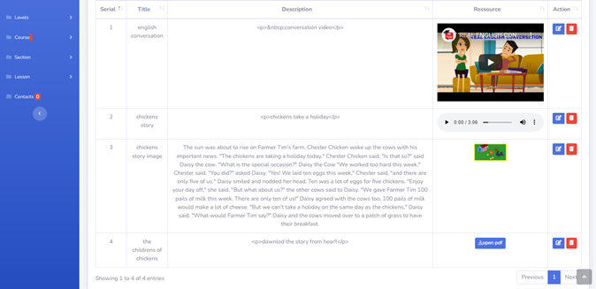  
- **Messages**  
  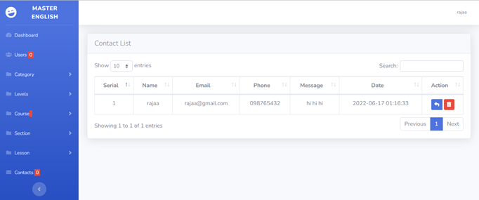  

---

## ✅ **Conclusion**
Ce projet E-Learning offre une solution complète pour l'enseignement en ligne avec une gestion simplifiée des cours, des utilisateurs et des ressources pédagogiques. Il garantit une expérience fluide et interactive pour les apprenants et les administrateurs. 🚀

